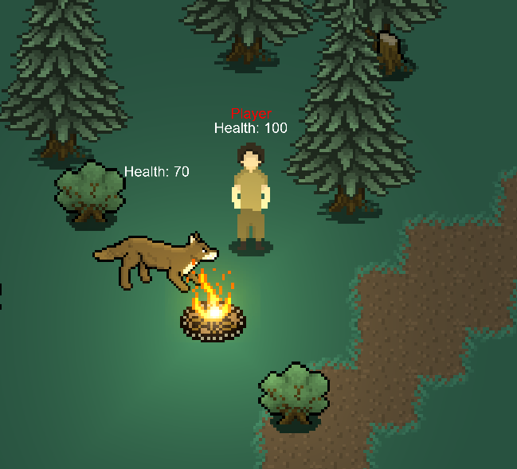

# 2DStarve

# About / FAQ
## What is this game about?
This game is a 2D multiplayer survival game focused on using natural resources to make technological advances to make survival easier, and is made by me and a friend (Kirin). Various biomes exist, including forests, snowy mountains, deserts, and a magical forest, all with their unique set of creatures and armor.
## Why did you make this game?
This game was created to be a fun side project to distract ourselves for school, and not meant to be profitable. We (Kirin & I) thought it would be fun to learn how to work as a team to make a game.
## What experience do you guys have?
I have been programming for 5+ years in robotics, web development, and software development. Kirin has been drawing for 4-5 years, and has been in band for a very long time. We made this game in hopes of broadening our horizons in the fields of network programming and pixel art.
## When will early access be released?
Probably next year; We have school. 

# Running the game
## Windows
The game has been tested to run on Windows 10, and should run by simply running the executable.
