# 2DStarve

## About / FAQ
### What is this game about?
This game is a 2D multiplayer survival game focused on using natural resources to make technological advances to make survival easier, and is made by me and a friend (Kirin); It is made using Photon Bolt and Unity.
### Why did you make this game?
This game was created to be a fun side project to distract ourselves for school. We thought it would be fun to learn how to work as a team to make a game.
### What experience do you guys have?
I have been programming for 5+ years in robotics, web development, and software development. Kirin has been drawing for 4-5 years, and has been in band for a very long time. We made this game in hopes of broadening our horizons in the fields of network programming and pixel art.
### When will early access be released?
Never lol

## Running the game
### Windows
The game has been tested to run on Windows 10, and should run by simply running the executable.

### Linux
The game has been tested to run on Debian-based distributions, and should run by simply running the executable.

## Seeting up Tiled to make maps

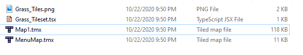

Firstly, download this project and go to `\Maps` to find the four files listed above. The files' purpose are as follows:
* `Grass_Tiles.png` is the raw image of the tiles.
* `Grass_Tiles.tsx` is the data file Tiled uses to grab them from the file with a few other extra stuff; I parsed them myself. It requires the included `Grass_Tiles.png`.
* `.tmx` files are the maps themselves. They require a `.tsx` file.

Feel free to view any of the `.tmx` files at your leisure.

To create your own map, go to `File > New Map` in Tiled. Copy the exact settings as shown below and save to wherever you like. The actual `Map Size` of the map doesn't matter; It can be infinite or fixed at any size.

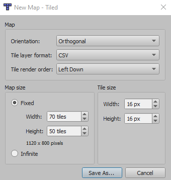

After that, drag in `Grass_Tiles.tsx` into the `Tilesets` window; This will tell Tiled where to look for tile data.

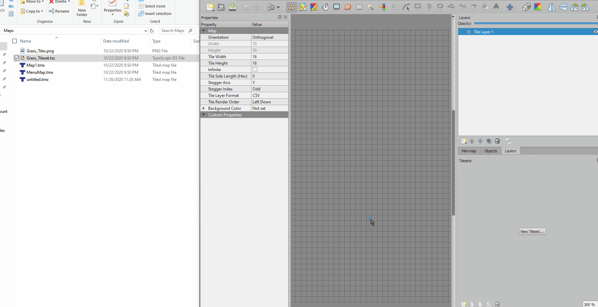

### Creating Maps
Tiled has a bunch of great, advanced tools that can be used for map development. For the purpose of this basic tutorial, I'll only cover the necessities.
* **Stamp Brush** - This is the most *basic* tool you'll use when adding tiles. Simply click on a tile from the tilemap and click on the map to automatically switch to it; Just like a stamp! 
* **Erase** - Erases tiles of a layer completely. 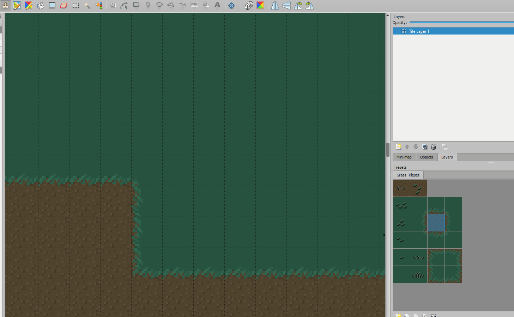
* **Terrain Brush** - This is a brush that automatically combines dirt and grass tiles to make drawing nice paths a lot easier. In the tilesets window, click `Terrains` and click the path you want to draw on and draw. **Note: You have to draw over blocks of the opposite type; Drawing over deleted terrain won't create edges.** 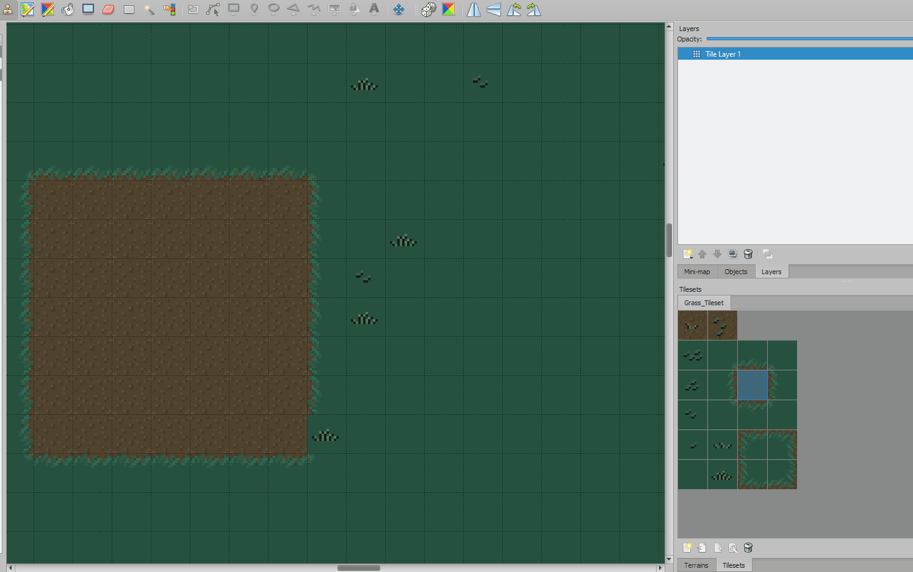
* **Selection Tool** - Does exactly what you think it does. 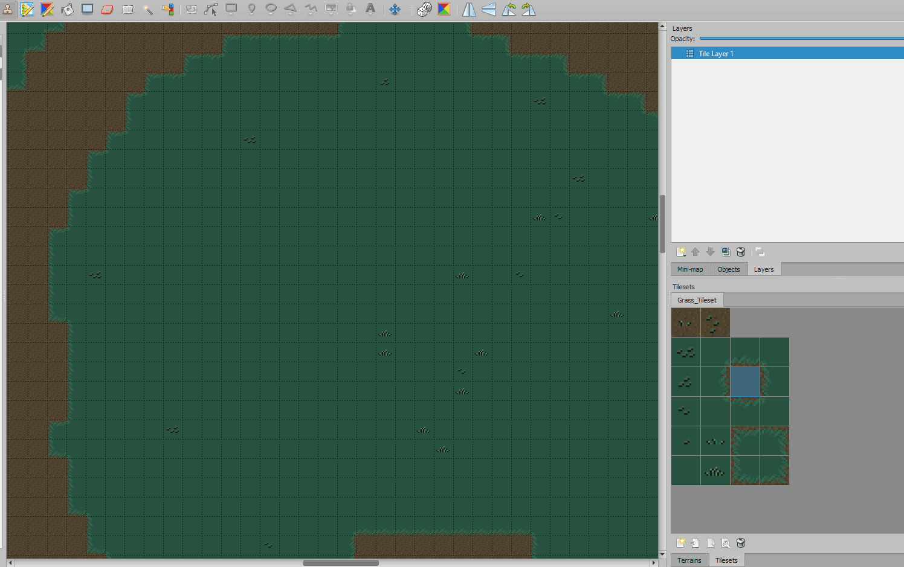
* **Fill Tool** - Pretty intuitive; Fills up all "like" tiles. 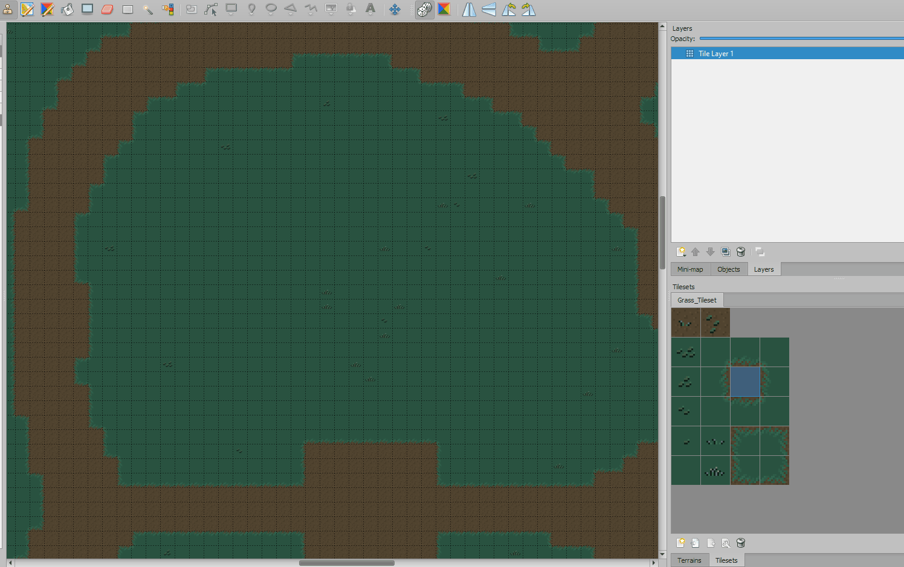

To add entities to the game, you must create an object layer with a specific name; Any points you make in this layer will represent the mob with that name.
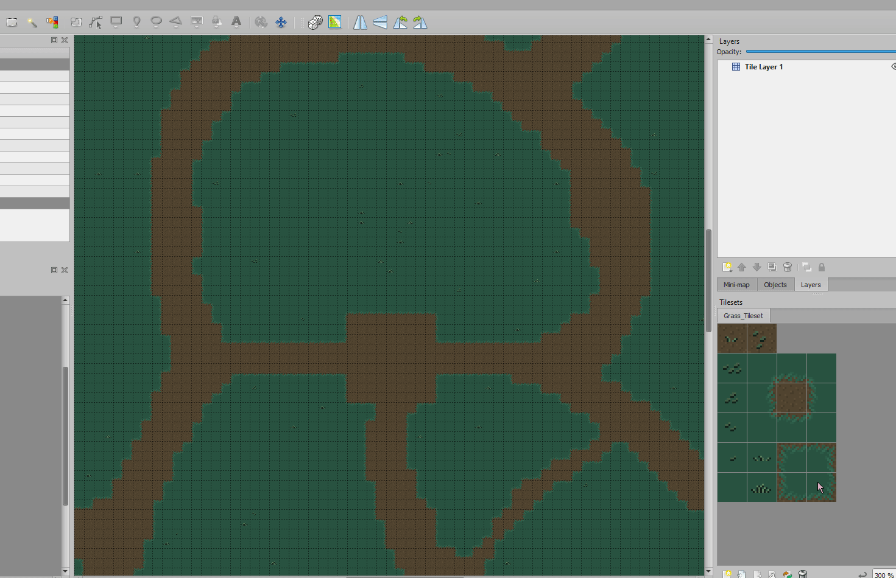
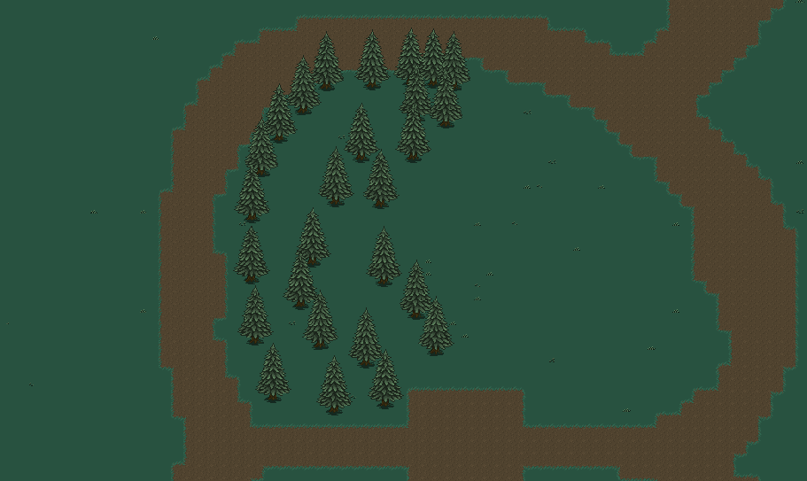

When you add multiple layers, knowing which point is which can get confusing. To alleviate this, you can change the color of a layer by clicking it and going to the properties window. 
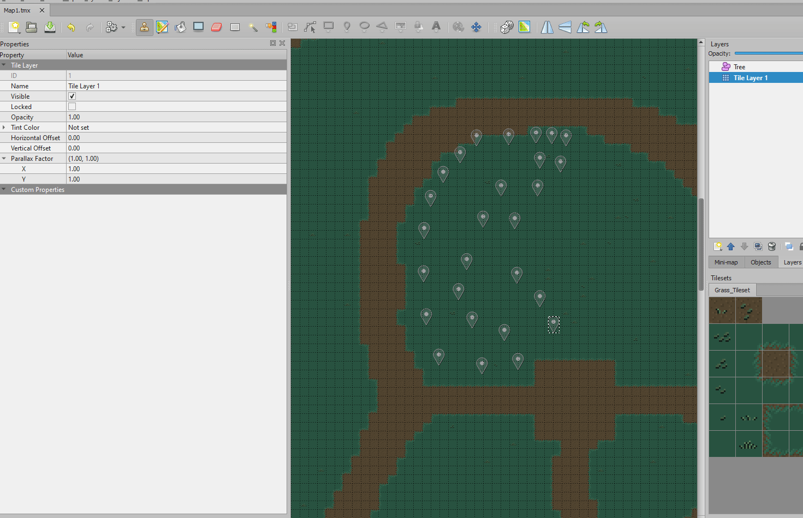

For example, here's a valid map for the game using a lot of mobs:
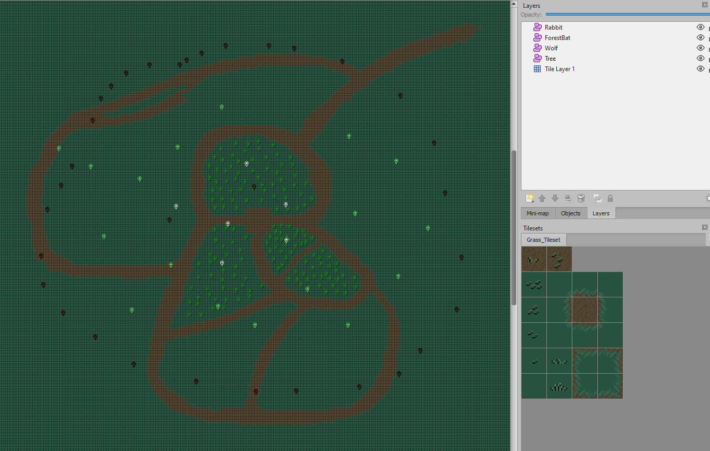

As for what mobs you can spawn using layer names, here is the full list:

    Tree
    Rabbit
    Wolf
    ForestBat

Each mob listed will be spawned at their respective points near their feet, including trees.
